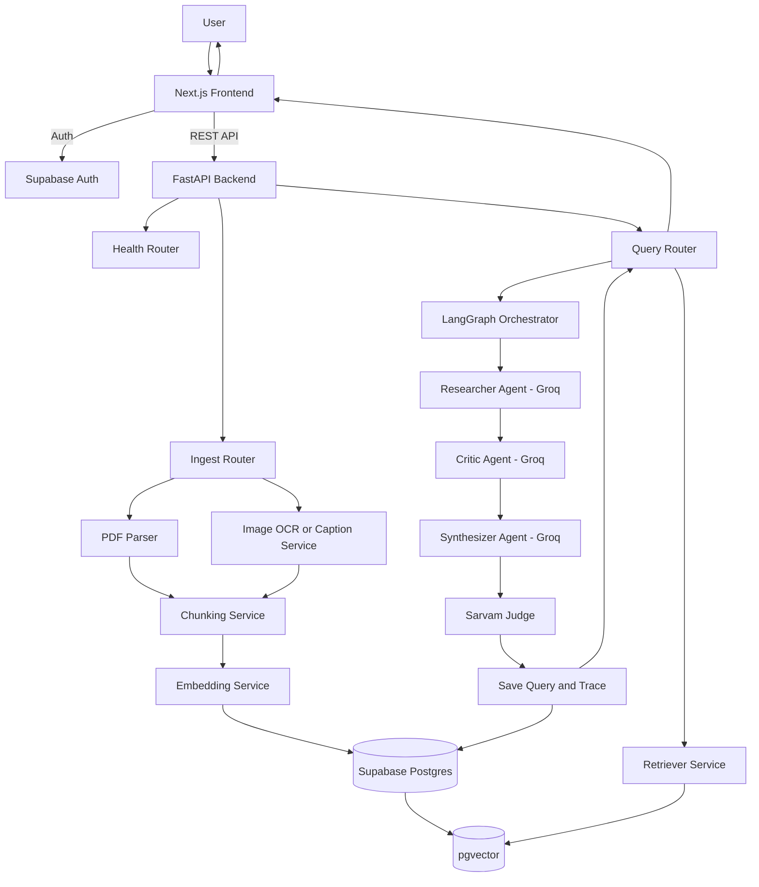
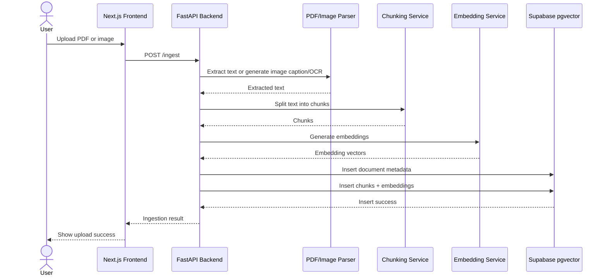
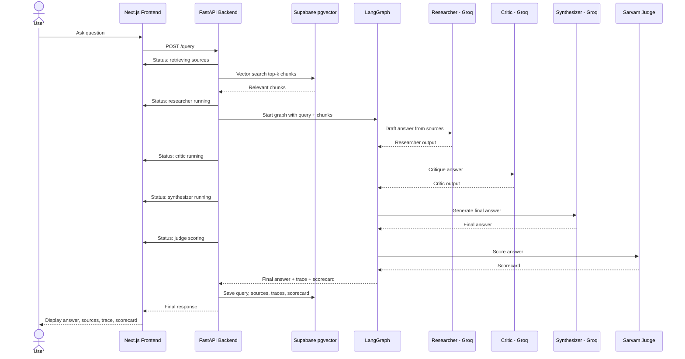
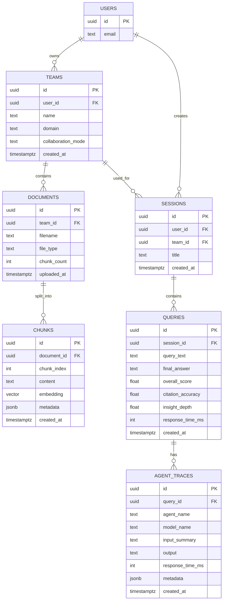
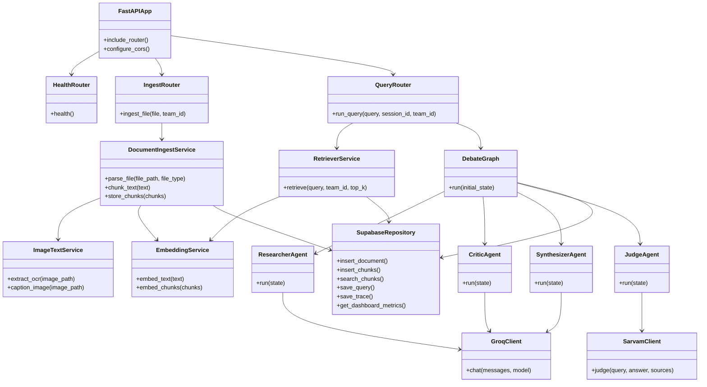

# Multi-Agent Multi-Model RAG Research Platform

> **Full PRD + SOW + Technical Architecture + Handoff Document**  
> GitHub-ready Markdown with Mermaid diagrams  
> Target role: **Software Engineer Intern / AI Engineer Intern**

---

## Document Control

| Field | Value |
|---|---|
| Project Name | Multi-Agent Multi-Model RAG Research Platform |
| Document Type | PRD + SOW + Technical Handoff |
| Version | v1.0 MVP Handoff |
| Primary Audience | Engineering team, reviewer, mentor, interviewer |
| Target Delivery | 22-day MVP build |
| Core Stack | Next.js, FastAPI, Supabase pgvector, LangGraph, LlamaIndex, Groq, Sarvam |
| Main Goal | Build a traceable multi-agent RAG research assistant with document-grounded answers |

---

# 1. Executive Summary

The **Multi-Agent Multi-Model RAG Research Platform** is a browser-based research assistant where users upload knowledge-base documents and ask complex questions. The system retrieves relevant document chunks, runs a multi-agent reasoning workflow, and returns a final answer with citations, agent traces, and quality scores.

The core agent pipeline is:

```text
Researcher → Critic → Synthesizer → Sarvam Judge
```

The MVP demonstrates:

- Multi-agent collaboration
- Multi-model LLM usage
- Retrieval-Augmented Generation
- Document-grounded answers
- Source traceability
- Agent-level transparency
- Research scorecards
- Query history
- Basic analytics
- Production-style architecture and handoff discipline

This document is designed to be used as a real engineering handoff for implementation.

---

# 2. Product Objective

## 2.1 Problem Statement

Most basic RAG applications use a single model to retrieve context and generate an answer. This often creates several issues:

- Answers may contain unsupported claims.
- The user cannot see how the answer was produced.
- There is no structured critique or quality review.
- Model contribution is hidden.
- Research history and scoring are often missing.

This project solves that by using multiple specialized agents:

1. **Researcher** — reads retrieved sources and drafts an initial answer.
2. **Critic** — identifies unsupported claims, missing context, and reasoning gaps.
3. **Synthesizer** — produces a refined final answer.
4. **Judge** — scores the final answer for quality, citation accuracy, and insight depth.

---

## 2.2 Product Goal

Build a working MVP where a user can:

- Register and log in
- Create a multi-agent research team
- Configure agent roles and assigned models
- Upload PDF documents and minimal image files
- Ask questions from the browser
- View the answer with citations
- View the full agent collaboration trace
- View a research scorecard
- Review past research history
- View basic analytics

---

## 2.3 Core Value Proposition

> A transparent multi-agent research system that improves answer quality by combining retrieval, critique, synthesis, and scoring.

---

# 3. Source Specification Alignment

## 3.1 Original Platform Expectations

The source project specification expects the platform to support:

- Multi-agent collaboration
- Multi-model agents
- Advanced RAG
- User authentication
- Agent team creation
- Browser-based chat
- Uploadable knowledge base
- At least PDF + image support
- Live collaboration trace
- Research history
- Basic analytics
- Research scorecard
- Free/open-source/local-first technology choices

This handoff follows the functional expectations closely, while making one explicit implementation tradeoff regarding model hosting.

---

## 3.2 Explicit Stack Deviation

The original project direction prefers a fully local and open-source stack using local quantized models, such as Ollama.

This MVP intentionally uses:

- **Groq** for fast role-specialized LLM agents
- **Sarvam** for answer judging and future multilingual support
- **Supabase pgvector** for database and vector search

### Reason for Deviation

The Groq + Sarvam approach is chosen to improve:

- Demo speed
- Laptop feasibility
- Model response quality
- Engineering focus on orchestration and RAG rather than local model setup

### Mitigation

The architecture keeps the LLM layer isolated behind wrapper clients:

```text
GroqClient
SarvamClient
```

This allows a future replacement with:

```text
OllamaClient
LocalJudgeClient
```

without rewriting the full system.

---

## 3.3 Compliance Rating After This Revision

| Area | Target Compliance |
|---|---:|
| Multi-agent workflow | High |
| Multi-model usage | High |
| RAG workflow | Medium-High |
| PDF upload | High |
| Minimal image support | Medium |
| Agent team configuration | Medium-High |
| Browser chat | High |
| Collaboration trace | Medium-High |
| Research history | High |
| Analytics | Medium |
| Scorecard | High |
| Local-first restriction | Partial due to intentional Groq/Sarvam deviation |

Expected PDF-compliance rating after this revision: **8.4 / 10**.

---

# 4. MVP Scope

## 4.1 In Scope

| Area | Included in MVP |
|---|---|
| Authentication | Register, login, logout, profile page |
| Agent Team | Create one default team, configure roles, model choices, prompts |
| Documents | PDF upload, minimal image upload support |
| PDF RAG | Extract text, chunk, embed, store, retrieve |
| Image Support | Upload PNG/JPG, generate basic OCR/caption text, store as retrievable document text |
| Vector Database | Supabase Postgres with pgvector |
| Orchestration | LangGraph sequential multi-agent workflow |
| LLM Agents | Groq-powered Researcher, Critic, Synthesizer |
| Judge | Sarvam-powered scoring agent |
| Chat | Browser-based chat interface |
| Trace | Step-based collaboration trace with model badges |
| History | Saved queries, final answers, trace, score |
| Analytics | Total queries, average response time, average score, queries over time |
| Testing | Unit, integration, failure, and evaluation tests |

---

## 4.2 Out of Scope for MVP

| Feature | Reason Deferred |
|---|---|
| Full image reasoning | MVP only stores OCR/caption text from images |
| Advanced table extraction | Tables inside PDFs are treated as extracted text where possible |
| Multi-user collaboration | Not required for first research assistant demo |
| Agent marketplace | Product expansion feature |
| Webhooks | Integration feature, not core MVP |
| External tool calling | Adds complexity and safety concerns |
| RAG versioning | Advanced knowledge-management feature |
| A/B testing of agent architectures | Deferred to evaluation tooling later |
| Long-term memory | Not required for initial traceable RAG workflow |
| Dynamic routing | Phase 2 improvement |

---

# 5. Personas and Users

## 5.1 Primary User

### Student / Researcher / Intern

Needs:

- Upload documents
- Ask complex questions
- Get traceable answers
- Understand how the answer was formed
- Evaluate answer quality

---

## 5.2 Secondary User

### Engineering Reviewer / Interviewer

Needs:

- Inspect system architecture
- Verify full-stack engineering ability
- See RAG implementation
- See multi-agent orchestration
- Review test strategy
- Assess tradeoff reasoning

---

# 6. Functional Requirements

## 6.1 Authentication

### Requirements

- User can register with email and password.
- User can log in securely.
- User can log out.
- User can view a basic profile page.
- Unauthenticated users cannot access app pages.

### Acceptance Criteria

- Login page works.
- Register page works.
- Profile page displays user email.
- Protected routes redirect unauthenticated users.

---

## 6.2 Agent Team Configuration

### Requirements

The MVP supports one default team per user, while the database supports future multiple teams.

User can configure:

- Team name
- Research domain
- Collaboration mode
- Agent roles
- Assigned model per agent
- System prompt per agent
- Response style preference

### Default Team

```text
Team Name: Default Research Team
Collaboration Mode: Sequential Review
Agents:
- Researcher
- Critic
- Synthesizer
- Judge
```

### Default Model Assignment

| Agent | Provider | Model Purpose |
|---|---|---|
| Researcher | Groq | Fast initial document-grounded answer |
| Critic | Groq | Review and critique |
| Synthesizer | Groq | Final answer generation |
| Judge | Sarvam | Structured quality scoring |

### Acceptance Criteria

- User can create/configure a team.
- User can edit agent prompt and model assignment.
- Query trace shows which model each agent used.

---

## 6.3 Knowledge Base Upload

### Requirements

User can upload:

- PDF files
- TXT files if simple support is added
- PNG/JPG images with minimal OCR/caption handling

### PDF Handling

PDF files should be:

1. Uploaded from frontend
2. Sent to backend
3. Parsed for text
4. Split into chunks
5. Embedded
6. Stored in Supabase pgvector

### Minimal Image Handling

Image files should be:

1. Uploaded from frontend
2. Passed through basic OCR or caption generation
3. Converted into text description
4. Stored as document text chunks
5. Made retrievable during query

### Table Handling

Tables inside PDFs are supported only if the PDF parser extracts their text. Structured table parsing is deferred.

### Acceptance Criteria

- PDF upload creates document row.
- PDF upload creates chunk rows.
- Image upload creates document row and text/caption chunk.
- Chunks include embeddings.
- Uploaded documents are visible in the knowledge page.

---

## 6.4 Browser-Based Research Chat

### Requirements

The chat interface must include:

- Query input
- Submit button
- New session control
- Regenerate answer control
- Cite sources toggle or source display
- Processing status indicators
- Final answer display
- Source display
- Agent trace display
- Scorecard display

### Step-Based Status Indicators

True streaming is not required in MVP, but the UI should show clear progress stages:

```text
1. Retrieving sources
2. Researcher drafting answer
3. Critic reviewing answer
4. Synthesizer finalizing answer
5. Judge scoring answer
6. Saving result
```

### Acceptance Criteria

- User can ask a question.
- UI shows progress stage.
- Final answer appears.
- Sources appear.
- Agent trace appears.
- Scorecard appears.

---

## 6.5 Research History

### Requirements

History page must show:

- Date/time
- Query text
- Team used
- Quality score
- Final answer preview
- Link to full trace view

Detailed history view must show:

- Full query
- Final answer
- Retrieved sources
- Per-agent trace
- Scorecard

### Deferred

- Export PDF
- Export JSON

### Acceptance Criteria

- Past queries are saved.
- User can view previous query details.
- Trace and scorecard are available for each query.

---

## 6.6 Analytics Dashboard

### MVP Metrics

Dashboard should show:

- Total queries
- Average response time
- Average overall score
- Average citation accuracy
- Average insight depth
- Queries over time
- Model usage count from trace rows

### Deferred Metrics

- Common failure modes dashboard
- Most improved queries
- Report export PDF/CSV
- Per-model quality trends

### Acceptance Criteria

- Dashboard loads metrics from Supabase.
- Metrics update after new queries.
- Query count and average response time are visible.

---

## 6.7 Research Scorecard

### Requirements

Judge returns:

```json
{
  "overall": 8,
  "citation_accuracy": 7,
  "insight_depth": 8,
  "reasoning": "The answer is grounded and clear but misses one source detail."
}
```

### Acceptance Criteria

- Scorecard has all required fields.
- Scorecard is displayed in chat.
- Scorecard is saved with query history.

---

# 7. Non-Functional Requirements

## 7.1 Performance

| Operation | Target |
|---|---:|
| Health check | < 300 ms |
| PDF upload response | Depends on PDF size |
| Retrieval | < 2 seconds |
| Full query pipeline | < 20 seconds for small documents |
| Dashboard load | < 2 seconds |

---

## 7.2 Security

- Store secrets only in `.env` files.
- Never commit API keys.
- Use Supabase Row Level Security.
- Users can only access their own teams, documents, sessions, queries, and traces.
- Validate file type and size before ingestion.

---

## 7.3 Reliability

- API errors should return clear messages.
- Groq failure should not crash server process.
- Sarvam failure should return answer with scorecard unavailable.
- Empty retrieval should produce an “insufficient context” response.

---

## 7.4 Maintainability

- Keep LLM providers behind wrapper clients.
- Keep RAG code independent from routers.
- Keep agents independent from API layer.
- Keep database logic in repository/helper layer.
- Use clear file names and modular boundaries.

---

# 8. High-Level Architecture



---

# 9. Data Flow Diagrams

## 9.1 Document Ingestion Flow



---

## 9.2 Query Answering Flow



---

# 10. Database Design

## 10.1 Entity Relationship Diagram



---

## 10.2 Schema Draft

```sql
create extension if not exists vector;

create table teams (
  id uuid primary key default gen_random_uuid(),
  user_id uuid references auth.users(id) on delete cascade,
  name text not null,
  domain text,
  collaboration_mode text default 'sequential',
  created_at timestamptz default now()
);

create table agents (
  id uuid primary key default gen_random_uuid(),
  team_id uuid references teams(id) on delete cascade,
  role text not null,
  model_provider text not null,
  model_name text not null,
  system_prompt text,
  response_style text,
  position int default 0,
  created_at timestamptz default now()
);

create table documents (
  id uuid primary key default gen_random_uuid(),
  team_id uuid references teams(id) on delete cascade,
  filename text not null,
  file_type text default 'pdf',
  chunk_count int default 0,
  uploaded_at timestamptz default now()
);

create table chunks (
  id uuid primary key default gen_random_uuid(),
  document_id uuid references documents(id) on delete cascade,
  chunk_index int not null,
  content text not null,
  embedding vector(384),
  metadata jsonb default '{}',
  created_at timestamptz default now()
);

create table sessions (
  id uuid primary key default gen_random_uuid(),
  user_id uuid references auth.users(id) on delete cascade,
  team_id uuid references teams(id) on delete cascade,
  title text,
  created_at timestamptz default now()
);

create table queries (
  id uuid primary key default gen_random_uuid(),
  session_id uuid references sessions(id) on delete cascade,
  query_text text not null,
  final_answer text,
  overall_score float,
  citation_accuracy float,
  insight_depth float,
  response_time_ms int,
  created_at timestamptz default now()
);

create table agent_traces (
  id uuid primary key default gen_random_uuid(),
  query_id uuid references queries(id) on delete cascade,
  agent_name text not null,
  model_name text,
  input_summary text,
  output text,
  response_time_ms int,
  metadata jsonb default '{}',
  created_at timestamptz default now()
);

create index chunks_embedding_idx
on chunks
using ivfflat (embedding vector_cosine_ops)
with (lists = 100);
```

---

# 11. Class and Module Relationship Diagram



---

# 12. Recommended Repository Structure

```text
RAG-platform/
├── README.md
├── docker-compose.yml
├── .gitignore
├── .env.example
├── docs/
│   ├── PRD-SOW-HANDOFF.md
│   ├── ARCHITECTURE.md
│   ├── TESTING.md
│   └── EVALUATION.md
│
├── frontend/
│   ├── app/
│   │   ├── login/page.tsx
│   │   ├── register/page.tsx
│   │   ├── profile/page.tsx
│   │   ├── dashboard/page.tsx
│   │   ├── team/page.tsx
│   │   ├── knowledge/page.tsx
│   │   ├── chat/page.tsx
│   │   └── history/page.tsx
│   ├── components/
│   │   ├── chat/
│   │   │   ├── ChatWindow.tsx
│   │   │   ├── QueryInput.tsx
│   │   │   ├── AgentTrace.tsx
│   │   │   ├── SourceList.tsx
│   │   │   └── ScoreCard.tsx
│   │   ├── knowledge/
│   │   │   └── UploadPanel.tsx
│   │   ├── dashboard/
│   │   │   ├── MetricsCards.tsx
│   │   │   └── QueriesChart.tsx
│   │   └── layout/
│   │       ├── Header.tsx
│   │       └── Sidebar.tsx
│   ├── lib/
│   │   ├── api.ts
│   │   ├── supabase.ts
│   │   └── types.ts
│   ├── package.json
│   └── Dockerfile
│
├── backend/
│   ├── main.py
│   ├── routers/
│   │   ├── ingest.py
│   │   ├── query.py
│   │   ├── dashboard.py
│   │   └── health.py
│   ├── rag/
│   │   ├── chunking.py
│   │   ├── embeddings.py
│   │   ├── ingest.py
│   │   ├── image_text.py
│   │   └── retriever.py
│   ├── agents/
│   │   ├── researcher.py
│   │   ├── critic.py
│   │   ├── synthesizer.py
│   │   └── judge.py
│   ├── orchestration/
│   │   ├── state.py
│   │   └── graph.py
│   ├── llms/
│   │   ├── groq_client.py
│   │   └── sarvam_client.py
│   ├── db/
│   │   └── supabase.py
│   ├── tests/
│   │   ├── unit/
│   │   ├── integration/
│   │   └── evaluation/
│   ├── requirements.txt
│   └── Dockerfile
│
└── supabase/
    └── migrations/
        └── 001_initial_schema.sql
```

---

# 13. File and Folder Purpose Explanation

## 13.1 Root Files

| File / Folder | Intended Purpose |
|---|---|
| `README.md` | Main GitHub landing document. Explains project goal, setup, architecture, usage, and demo. |
| `docker-compose.yml` | Runs frontend and backend together for local reproducibility. |
| `.gitignore` | Prevents secrets, virtual environments, node_modules, and build artifacts from being committed. |
| `.env.example` | Documents required environment variables without exposing real secrets. |
| `docs/` | Stores detailed engineering documents separate from README. |
| `frontend/` | Contains the Next.js browser application. |
| `backend/` | Contains API routes, RAG pipeline, agent orchestration, and database logic. |
| `supabase/` | Contains SQL migrations for database setup. |

---

## 13.2 Documentation Files

| File | Intended Purpose |
|---|---|
| `docs/PRD-SOW-HANDOFF.md` | Full product requirements, statement of work, architecture, testing, and handoff document. |
| `docs/ARCHITECTURE.md` | Shorter focused architecture reference with diagrams and service boundaries. |
| `docs/TESTING.md` | Testing strategy, commands, and test coverage plan. |
| `docs/EVALUATION.md` | Evaluation dataset, scoring rubric, and single-agent vs multi-agent comparison notes. |

---

## 13.3 Frontend Files

| File / Folder | Intended Purpose |
|---|---|
| `frontend/app/login/page.tsx` | Login UI using Supabase Auth. |
| `frontend/app/register/page.tsx` | Registration UI using Supabase Auth. |
| `frontend/app/profile/page.tsx` | Basic profile page showing user email and logout control. |
| `frontend/app/dashboard/page.tsx` | Displays total queries, average response time, average score, and queries over time. |
| `frontend/app/team/page.tsx` | Allows user to configure the default research team and agent settings. |
| `frontend/app/knowledge/page.tsx` | Upload/manage PDFs and images in the knowledge base. |
| `frontend/app/chat/page.tsx` | Main research chat interface. |
| `frontend/app/history/page.tsx` | Shows previous queries, scores, and trace links. |
| `frontend/components/chat/ChatWindow.tsx` | Displays current conversation and final answers. |
| `frontend/components/chat/QueryInput.tsx` | Input box, submit button, regenerate button, and status state. |
| `frontend/components/chat/AgentTrace.tsx` | Displays Researcher, Critic, Synthesizer, and Judge outputs with model badges. |
| `frontend/components/chat/SourceList.tsx` | Shows citations and retrieved source previews. |
| `frontend/components/chat/ScoreCard.tsx` | Displays overall score, citation accuracy, insight depth, and judge reasoning. |
| `frontend/components/knowledge/UploadPanel.tsx` | Handles PDF/image upload from the browser. |
| `frontend/components/dashboard/MetricsCards.tsx` | Displays dashboard metric cards. |
| `frontend/components/dashboard/QueriesChart.tsx` | Displays queries over time chart. |
| `frontend/components/layout/Header.tsx` | Top navigation bar. |
| `frontend/components/layout/Sidebar.tsx` | Side navigation for dashboard, team, knowledge, chat, history, profile. |
| `frontend/lib/api.ts` | Centralized FastAPI request functions. |
| `frontend/lib/supabase.ts` | Supabase browser client setup. |
| `frontend/lib/types.ts` | Shared TypeScript interfaces for documents, queries, traces, scorecards, metrics. |
| `frontend/package.json` | Frontend dependencies and scripts. |
| `frontend/Dockerfile` | Container build for frontend. |

---

## 13.4 Backend Files

| File / Folder | Intended Purpose |
|---|---|
| `backend/main.py` | FastAPI entry point. Registers routers and middleware. |
| `backend/routers/health.py` | Health check endpoint. |
| `backend/routers/ingest.py` | Handles PDF/image upload and calls ingestion service. |
| `backend/routers/query.py` | Handles user questions and runs retrieval + agent graph. |
| `backend/routers/dashboard.py` | Returns dashboard metrics from saved query data. |
| `backend/rag/chunking.py` | Splits extracted text into overlapping chunks. |
| `backend/rag/embeddings.py` | Generates embeddings for chunks and queries. |
| `backend/rag/ingest.py` | Main ingestion pipeline: parse file, chunk, embed, store. |
| `backend/rag/image_text.py` | Minimal image OCR/caption extraction for image upload support. |
| `backend/rag/retriever.py` | Retrieves top-k relevant chunks from Supabase pgvector. |
| `backend/agents/researcher.py` | Uses Groq to draft an answer from retrieved chunks. |
| `backend/agents/critic.py` | Uses Groq to critique the Researcher answer. |
| `backend/agents/synthesizer.py` | Uses Groq to produce the final answer. |
| `backend/agents/judge.py` | Uses Sarvam to score the final answer. |
| `backend/orchestration/state.py` | Defines shared state object passed through LangGraph. |
| `backend/orchestration/graph.py` | Defines LangGraph nodes, edges, and execution order. |
| `backend/llms/groq_client.py` | Wrapper around Groq API. Keeps provider usage isolated. |
| `backend/llms/sarvam_client.py` | Wrapper around Sarvam API. Used by judge and future language features. |
| `backend/db/supabase.py` | Supabase database client and repository helper functions. |
| `backend/tests/unit/` | Unit tests for isolated modules. |
| `backend/tests/integration/` | End-to-end API and pipeline tests. |
| `backend/tests/evaluation/` | Evaluation scripts and benchmark queries. |
| `backend/requirements.txt` | Backend Python dependencies. |
| `backend/Dockerfile` | Container build for backend. |

---

## 13.5 Supabase Files

| File | Intended Purpose |
|---|---|
| `supabase/migrations/001_initial_schema.sql` | Creates tables, pgvector extension, indexes, and RLS policies. |

---

# 14. API Contract

## 14.1 Health Check

```http
GET /health
```

Response:

```json
{
  "status": "ok"
}
```

---

## 14.2 Ingest Document

```http
POST /ingest
Content-Type: multipart/form-data
```

Request fields:

| Field | Type | Required | Purpose |
|---|---|---|---|
| `file` | PDF/PNG/JPG | Yes | Uploaded knowledge document |
| `team_id` | string | Yes | Team ownership reference |

Response:

```json
{
  "document_id": "uuid",
  "filename": "sample.pdf",
  "file_type": "pdf",
  "chunks_created": 42
}
```

---

## 14.3 Run Query

```http
POST /query
Content-Type: application/json
```

Request:

```json
{
  "query": "What are the key findings in this document?",
  "team_id": "uuid",
  "session_id": "uuid"
}
```

Response:

```json
{
  "query_id": "uuid",
  "final_answer": "...",
  "sources": [
    {
      "document_id": "uuid",
      "filename": "sample.pdf",
      "chunk_index": 3,
      "content_preview": "...",
      "score": 0.82
    }
  ],
  "scorecard": {
    "overall": 8,
    "citation_accuracy": 7,
    "insight_depth": 8,
    "reasoning": "The answer is well grounded but misses one supporting detail."
  },
  "agent_trace": [
    {
      "agent_name": "Researcher",
      "model_name": "groq-researcher-model",
      "output": "...",
      "response_time_ms": 1200
    },
    {
      "agent_name": "Critic",
      "model_name": "groq-critic-model",
      "output": "...",
      "response_time_ms": 1100
    },
    {
      "agent_name": "Synthesizer",
      "model_name": "groq-synthesizer-model",
      "output": "...",
      "response_time_ms": 2300
    },
    {
      "agent_name": "Judge",
      "model_name": "sarvam-judge-model",
      "output": "...",
      "response_time_ms": 900
    }
  ]
}
```

---

## 14.4 Dashboard Metrics

```http
GET /dashboard/metrics
```

Response:

```json
{
  "total_queries": 25,
  "average_response_time_ms": 8700,
  "average_overall_score": 8.1,
  "average_citation_accuracy": 7.8,
  "average_insight_depth": 8.0,
  "queries_over_time": [
    {
      "date": "2026-04-29",
      "count": 5
    }
  ],
  "model_usage": [
    {
      "model_name": "groq-researcher-model",
      "count": 25
    }
  ]
}
```

---

# 15. Agent Responsibilities

## 15.1 Researcher Agent

### Purpose

Produces the initial answer using only retrieved document chunks.

### Input

- User query
- Retrieved chunks
- Source metadata

### Output

- Initial answer
- Cited source references

### Rules

- Must not invent unsupported claims.
- Must cite source chunks.
- Must state when context is insufficient.

---

## 15.2 Critic Agent

### Purpose

Reviews the Researcher output for correctness, grounding, and completeness.

### Input

- User query
- Researcher answer
- Retrieved chunks

### Output

- Unsupported claims
- Missing evidence
- Suggested corrections
- Reasoning gaps

---

## 15.3 Synthesizer Agent

### Purpose

Creates the final answer by combining the Researcher draft and Critic feedback.

### Input

- User query
- Retrieved chunks
- Researcher answer
- Critic feedback

### Output

- Final answer
- Citations
- Caveats where needed

---

## 15.4 Sarvam Judge Agent

### Purpose

Scores the final answer.

### Input

- User query
- Final answer
- Source list

### Output

```json
{
  "overall": 8,
  "citation_accuracy": 7,
  "insight_depth": 8,
  "reasoning": "..."
}
```

---

# 16. RAG Design

## 16.1 MVP Retrieval

The MVP uses:

- One embedding model
- Supabase pgvector
- Cosine similarity
- Top-k retrieval
- Source metadata preservation

---

## 16.2 Phase 2 Retrieval Roadmap

To better match advanced multi-model RAG expectations, Phase 2 adds:

- Hybrid keyword + vector search
- Reranking
- Multi-embedding comparison
- Per-document retrieval diagnostics
- Retrieval accuracy dashboard

---

# 17. Phase-Wise Statement of Work

## Phase 1 — Project Setup and Foundation

Duration: Days 1–3

### Scope

- Initialize monorepo
- Create Next.js frontend
- Create FastAPI backend
- Add base routing
- Add `.env.example`
- Add health endpoint

### Deliverables

- Running frontend
- Running backend
- Health endpoint
- Initial README

### Acceptance Criteria

- Frontend starts locally.
- Backend starts locally.
- `/health` returns success.
- Repo structure matches handoff.

---

## Phase 2 — Supabase, Auth, and Schema

Duration: Days 4–5

### Scope

- Create Supabase project
- Enable pgvector
- Create database schema
- Add RLS policies
- Build login/register/profile pages

### Deliverables

- Supabase migration
- Auth pages
- Profile page
- Protected routes

### Acceptance Criteria

- User can register.
- User can log in.
- User can log out.
- Profile shows user email.
- Tables exist in Supabase.

---

## Phase 3 — Knowledge Base Ingestion

Duration: Days 6–9

### Scope

- PDF parsing
- Minimal image OCR/caption support
- Chunking
- Embedding generation
- Supabase pgvector insertion

### Deliverables

- `/ingest` endpoint
- Document ingestion service
- Chunk storage
- Image text extraction module

### Acceptance Criteria

- PDF upload creates chunks.
- Image upload creates at least one retrievable text/caption chunk.
- Chunks include embeddings.
- Knowledge page lists uploaded files.

---

## Phase 4 — Retrieval and RAG API

Duration: Days 10–11

### Scope

- Query embedding
- Vector search
- Source formatting
- Empty retrieval handling

### Deliverables

- Retriever service
- Retrieval test script
- Source response format

### Acceptance Criteria

- Query returns top-k chunks.
- Retrieval result includes filename and chunk index.
- Empty retrieval returns controlled response.

---

## Phase 5 — Multi-Agent Orchestration

Duration: Days 12–15

### Scope

- Researcher agent
- Critic agent
- Synthesizer agent
- Sarvam Judge
- LangGraph state and graph

### Deliverables

- Agent modules
- Graph module
- Judge scoring
- Trace output

### Acceptance Criteria

- Agents execute in order.
- Each trace has agent name, model, output, latency.
- Final answer includes citations.
- Judge returns scorecard.

---

## Phase 6 — Query API and Persistence

Duration: Days 16–17

### Scope

- `/query` endpoint
- Save query result
- Save trace rows
- Save scores
- Return full frontend payload

### Deliverables

- Query route
- Persistence logic
- Response schema

### Acceptance Criteria

- Query endpoint works end-to-end.
- Query row saved.
- Agent trace rows saved.
- Scorecard saved.

---

## Phase 7 — Frontend Application

Duration: Days 18–20

### Scope

- Upload UI
- Chat UI
- Status indicators
- Agent trace UI
- Source list
- Scorecard
- History page
- Dashboard metrics

### Deliverables

- Full frontend MVP
- Connected pages
- Dashboard charts/cards

### Acceptance Criteria

- User can upload documents.
- User can ask a question.
- User can view progress status.
- User can view final answer.
- User can view trace and scorecard.
- User can view dashboard metrics.

---

## Phase 8 — Testing, Evaluation, and Handoff

Duration: Days 21–22

### Scope

- Unit testing
- Integration testing
- Failure testing
- Evaluation dataset
- README cleanup
- Demo script

### Deliverables

- Test suite
- Evaluation report
- Final documentation
- Demo-ready handoff

### Acceptance Criteria

- Core tests pass.
- Upload → query → trace flow works.
- Evaluation results are documented.
- README setup works from clean clone.

---

# 18. Day-Wise Execution Plan

| Day | Focus | Output |
|---|---|---|
| Day 1 | Repo setup | Monorepo, docs folder, initial README |
| Day 2 | Backend foundation | FastAPI app, health route, CORS |
| Day 3 | Frontend foundation | Next.js app, layout, navigation |
| Day 4 | Supabase schema | Tables, pgvector, RLS draft |
| Day 5 | Auth + profile | Login, register, logout, profile page |
| Day 6 | PDF parsing | Extract text from uploaded PDF |
| Day 7 | Image support | OCR/caption text from PNG/JPG |
| Day 8 | Chunking + embeddings | Chunks and vectors generated |
| Day 9 | Vector storage | Chunks stored in Supabase pgvector |
| Day 10 | Retrieval | Query retrieves top-k chunks |
| Day 11 | Retrieval hardening | Empty retrieval and source formatting |
| Day 12 | Researcher | Researcher returns cited draft |
| Day 13 | Critic | Critic reviews draft |
| Day 14 | Synthesizer | Final answer generation |
| Day 15 | Judge + LangGraph | Sarvam scoring and graph connected |
| Day 16 | Query API | `/query` endpoint works |
| Day 17 | Persistence | Query, traces, scores saved |
| Day 18 | Upload + knowledge UI | Browser upload and document list |
| Day 19 | Chat + trace UI | Answer, sources, trace, status indicators |
| Day 20 | Dashboard + history | Metrics and query history |
| Day 21 | Testing | Unit/integration/failure tests |
| Day 22 | Evaluation + handoff | Evaluation report, demo script, final README |

---

# 19. Testing Strategy

## 19.1 Unit Tests

| Module | Test Case |
|---|---|
| `chunking.py` | Splits text into expected chunk sizes |
| `chunking.py` | Preserves overlap correctly |
| `embeddings.py` | Returns vector with expected dimension |
| `image_text.py` | Returns text or fallback caption for image |
| `retriever.py` | Returns top-k chunks |
| `groq_client.py` | Handles successful and failed responses |
| `sarvam_client.py` | Parses scorecard JSON safely |
| `researcher.py` | Produces non-empty cited draft |
| `critic.py` | Produces critique output |
| `synthesizer.py` | Produces final answer |
| `judge.py` | Produces required score fields |

---

## 19.2 Integration Tests

| Flow | Expected Result |
|---|---|
| Register → login | Session created |
| Upload PDF | Document and chunks inserted |
| Upload image | Image text/caption chunk inserted |
| Query after upload | Relevant chunks retrieved |
| Query pipeline | All agents execute in order |
| Save query | Query and traces saved |
| Dashboard metrics | Metrics update after query |

---

## 19.3 Evaluation Testing

Create:

```text
backend/tests/evaluation/
├── docs/
│   ├── sample_1.pdf
│   ├── sample_2.pdf
│   └── sample_image.png
├── questions.json
├── run_eval.py
└── results.md
```

Example `questions.json`:

```json
[
  {
    "id": "q1",
    "question": "What is the main conclusion of sample 1?",
    "expected_source": "sample_1.pdf",
    "difficulty": "easy"
  },
  {
    "id": "q2",
    "question": "Compare the two main recommendations in sample 2.",
    "expected_source": "sample_2.pdf",
    "difficulty": "medium"
  },
  {
    "id": "q3",
    "question": "What information is visible in the uploaded image?",
    "expected_source": "sample_image.png",
    "difficulty": "easy"
  }
]
```

Compare:

| System | Purpose |
|---|---|
| Single-agent RAG | Baseline answer quality |
| Multi-agent RAG | Evaluate improvement through critique/synthesis |

Metrics:

- Citation correctness
- Answer completeness
- Hallucination rate
- Human preference
- Average latency
- Judge score

---

## 19.4 Failure Testing

| Failure Case | Expected Behavior |
|---|---|
| Empty PDF | Clear upload error |
| Unsupported file type | 400 response |
| No relevant chunks | Insufficient-context answer |
| Groq API failure | Controlled backend error |
| Sarvam API failure | Answer returned with scorecard unavailable |
| Invalid session ID | 400 or 404 |
| Unauthorized access | 401 or 403 |
| Very long query | Reject or truncate with clear message |

---

# 20. Logging and Observability

## 20.1 Events to Log

| Event | Fields |
|---|---|
| Upload started | user_id, filename, file_type, size |
| Upload completed | document_id, chunk_count, duration_ms |
| Query started | session_id, team_id, query_length |
| Retrieval completed | top_k, retrieved_count, duration_ms |
| Agent completed | agent_name, model_name, duration_ms |
| Judge completed | overall_score, duration_ms |
| Query completed | query_id, total_duration_ms |
| Error occurred | route, error_type, message |

## 20.2 Logging Rules

- Do not log API keys.
- Do not log full user documents unless debugging locally.
- Prefer structured logs.
- Include request IDs if possible.

---

# 21. Risk Register

| Risk | Impact | Likelihood | Mitigation |
|---|---:|---:|---|
| Hallucinated answers | High | Medium | Force answer from retrieved chunks and show citations |
| Poor retrieval | High | Medium | Tune chunking, top-k, embedding model |
| Image OCR quality weak | Medium | Medium | Label image support as minimal MVP feature |
| API dependency failure | Medium | Medium | Wrap Groq/Sarvam clients and return controlled errors |
| High latency | Medium | Medium | Use smaller models for Researcher/Critic |
| Supabase vector dimension mismatch | High | Low | Fix embedding dimension in schema and code |
| Over-scoped frontend | Medium | Medium | Keep UI simple and functional |
| Weak demo data | High | Medium | Prepare curated evaluation PDFs and image |

---

# 22. Engineering Tradeoffs

| Decision | Reason |
|---|---|
| Supabase pgvector instead of Pinecone | Keeps DB and vector search together; aligns with requested stack |
| Groq instead of local Ollama for MVP | Faster demo and lower local setup burden |
| Sarvam Judge | Adds structured evaluation and future multilingual path |
| Sequential LangGraph graph | Easier to build, test, and explain for MVP |
| Minimal image support | Satisfies PDF/image MVP requirement without full multimodal complexity |
| One default team initially | Simplifies UI while schema supports future multiple teams |
| Basic analytics only | Matches MVP without becoming an analytics product |
| Single embedding model in MVP | Keeps implementation feasible; hybrid RAG deferred to Phase 2 |

---

# 23. Future Roadmap

## Phase 2 Enhancements

| Feature | Priority |
|---|---|
| Hybrid keyword + vector search | High |
| Reranking | High |
| Streaming/SSE trace updates | High |
| Dynamic model routing | High |
| Debate loop with judge threshold | High |
| Better image reasoning | Medium |
| Structured table extraction | Medium |
| Multiple teams per user | Medium |
| Export PDF/JSON | Medium |
| Failure mode analytics | Medium |
| Local Ollama backend option | Medium |

---

# 24. Final Deliverables

| Deliverable | Description |
|---|---|
| GitHub repo | Full source code with clean structure |
| README.md | Setup, architecture, usage, and demo instructions |
| PRD-SOW-HANDOFF.md | This full handoff document |
| Supabase migration | Reproducible database schema |
| Working frontend | Auth, upload, chat, trace, scorecard, history, dashboard |
| Working backend | Ingest, retrieval, agents, query persistence |
| Test suite | Unit, integration, evaluation tests |
| Evaluation report | Baseline vs multi-agent comparison |
| Demo script | Step-by-step demo for reviewers |

---

# 25. Demo Script

## 25.1 Demo Setup

1. Start backend.
2. Start frontend.
3. Open app in browser.
4. Register or log in.
5. Create default research team.
6. Upload sample PDF.
7. Upload sample image.
8. Ask a question requiring document evidence.
9. Show final answer.
10. Open agent trace.
11. Open scorecard.
12. Open history.
13. Open dashboard.

---

## 25.2 Demo Talking Points

- “This is not a single-agent chatbot; each answer goes through research, critique, synthesis, and judging.”
- “The trace shows which model was used at each step.”
- “The final answer is grounded in retrieved chunks from uploaded documents.”
- “The scorecard evaluates citation accuracy and insight depth.”
- “The database stores documents, chunks, queries, and traces for auditability.”
- “The LLM provider layer is isolated, so Groq can later be replaced with Ollama.”

---

# 26. README Outline

Recommended `README.md` structure:

```text
1. Project title
2. Problem statement
3. Key features
4. Tech stack
5. Architecture diagram
6. Data flow
7. Folder structure
8. Environment variables
9. Supabase setup
10. Local setup
11. API documentation
12. Testing
13. Evaluation
14. Demo flow
15. Known limitations
16. Future improvements
```

---

# 27. Handoff Summary

This project should be positioned as:

> A production-style multi-agent RAG research platform that uses Groq for role-specialized agents, Sarvam for answer judging, and Supabase pgvector for document-grounded retrieval.

The most important engineering strengths are:

- Clear separation of frontend, backend, RAG, agents, and database
- Traceable multi-agent workflow
- Document-grounded answers
- Persistent query history
- Scorecard-based evaluation
- Testing and evaluation discipline
- Explicit tradeoff documentation

The implementation should prioritize:

1. Correct RAG retrieval
2. Clear citations
3. Stable agent pipeline
4. Visible traceability
5. Clean demo experience

Feature count is less important than a reliable end-to-end flow.

---

# 28. Final Compliance Rating

After this revision, the document is expected to score:

| Category | Rating |
|---|---:|
| Product objective alignment | 8.8 / 10 |
| MVP feature alignment | 8.5 / 10 |
| Must-have feature coverage | 8.3 / 10 |
| MVP exclusions respected | 9.0 / 10 |
| Recommended architecture alignment | 8.2 / 10 |
| Free/local-first restriction | 5.5 / 10 |
| Handoff quality | 9.2 / 10 |
| Intern project suitability | 9.0 / 10 |

## Overall PDF Compliance Rating

**8.4 / 10**

## Overall Intern-Level Project Rating

**9.0 / 10**

The only major remaining compliance gap is the intentional use of Groq and Sarvam instead of a fully local Ollama-based model stack.

---

# End of Document

