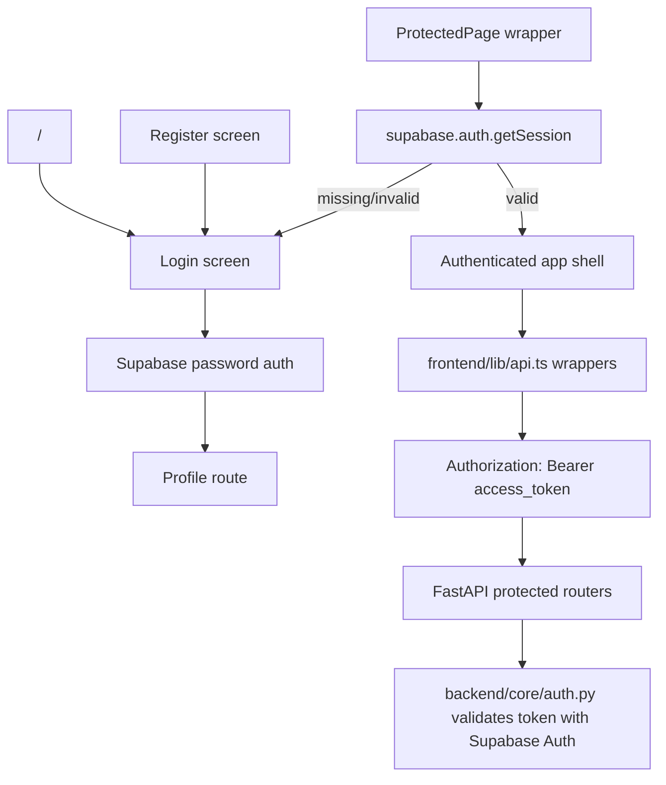
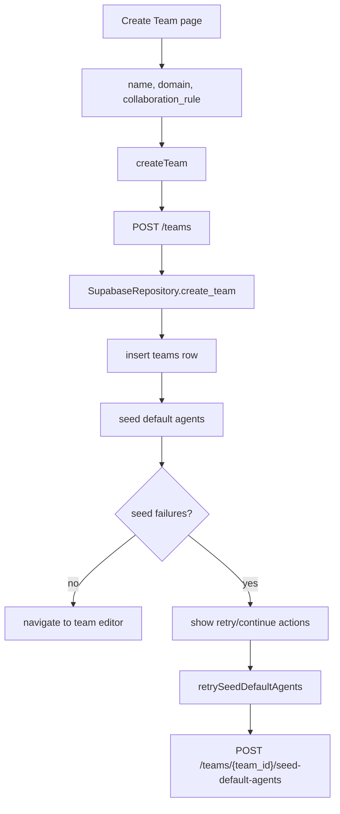
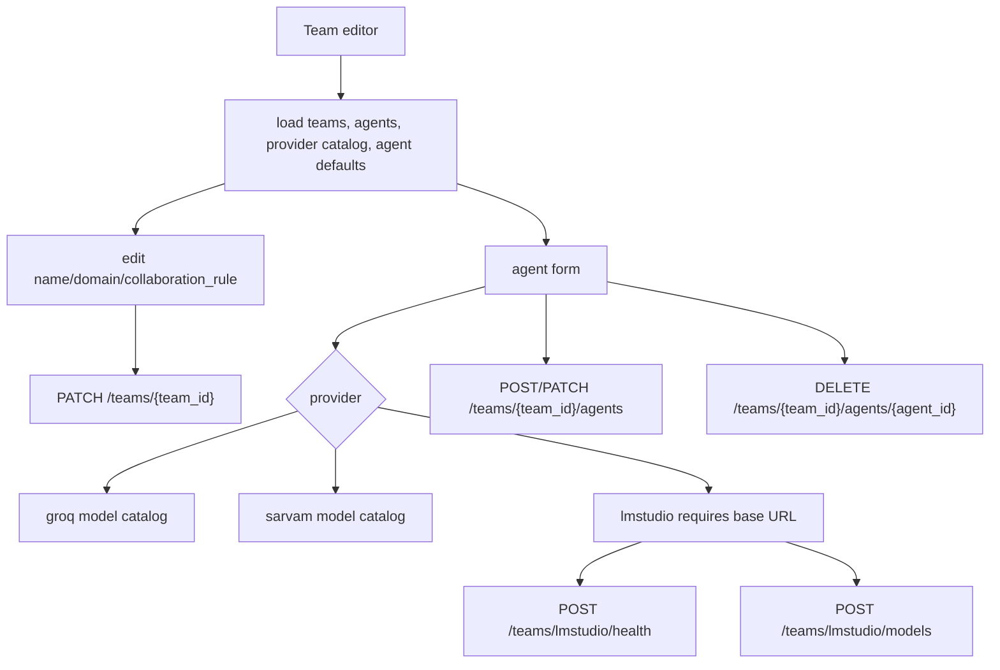
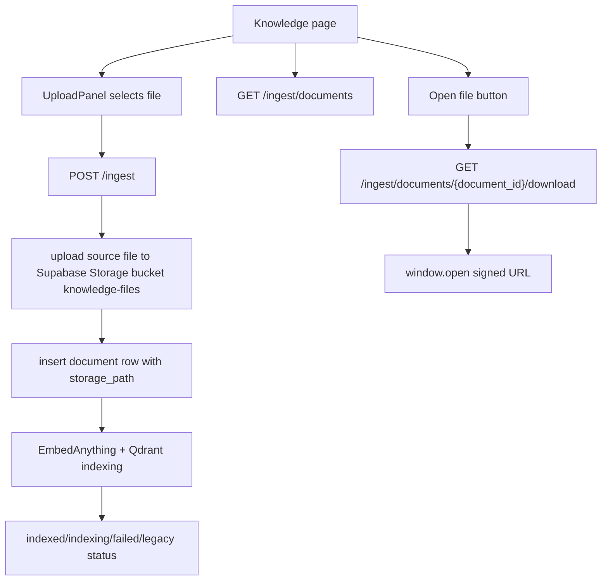
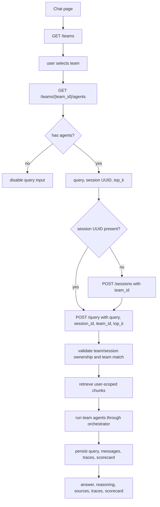
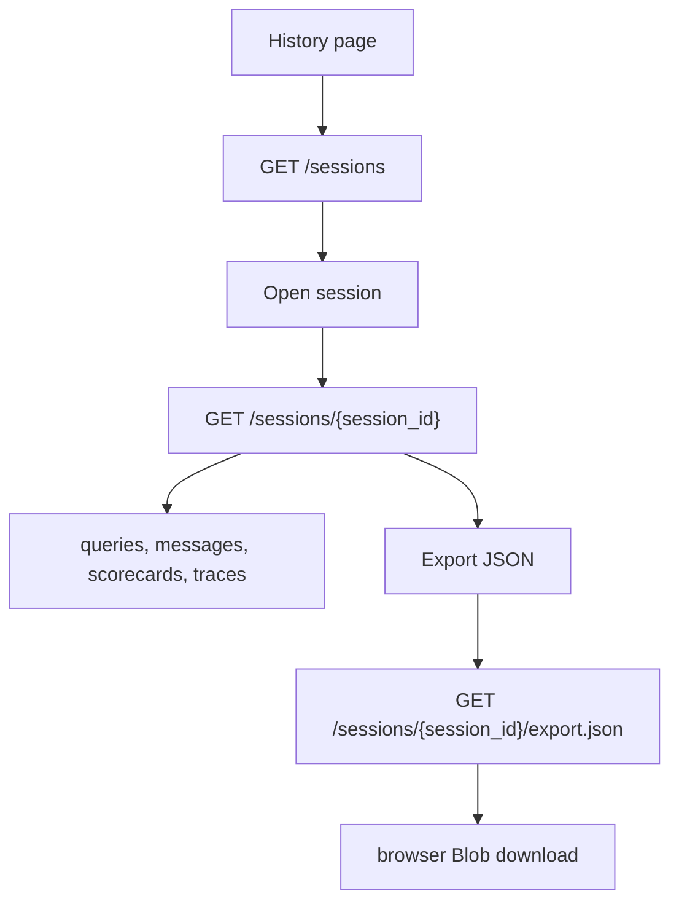

# UI Rebuild Handoff

This handoff is for a separate UI rebuild agent. It is based on the checkout at `c67ad922adb3b233fb9a064e3c8c9ca72b4e1432` on 2026-05-15. Preserve product behavior, backend contracts, auth/session handling, and Supabase data boundaries unless the product owner explicitly approves a backend/API change.

The existing `graphify-out/GRAPH_REPORT.md` is useful for navigation only. It says it was built from commit `01d22632`, while this handoff was written against `c67ad922adb3b233fb9a064e3c8c9ca72b4e1432`.

## 1. Product Intent And Preserve Rules

RAG Ops is an authenticated operator console for uploading user-owned knowledge files, configuring teams of agents, running team-scoped multi-agent RAG queries, inspecting sources/traces/scorecards, and exporting session history.

Preserve these current boundaries:

- Supabase Auth is the identity provider.
- Cloud Supabase is the source of truth for app data and storage.
- Uploaded documents are user-scoped for retrieval.
- Team selection controls orchestration, agent selection, and session ownership.
- Chat calls require an explicit `team_id` and `session_id`.
- Existing protected routes and API wrappers must remain callable.
- Do not hardcode agent defaults or model catalogs in the UI; fetch them from backend endpoints.
- LM Studio remains one supported local-model provider path, not the only provider.

## 2. Verified Frontend Stack

- Framework: Next `^16.2.6`, React `^19.2.5`, React DOM `^19.2.5`.
- Auth clients: `@supabase/ssr` and `@supabase/supabase-js`.
- Styling: global CSS in `frontend/app/globals.css`, CSS variables, custom class names, Material Symbols font CSS, and local fonts through `next/font/local`.
- No Tailwind config or PostCSS config was found in the checkout.
- Frontend commands live under `frontend/`, not repo root: `npm run dev`, `npm run build`, `npm run lint`, `npm run test`.

## 3. Current Route Inventory

| Route | Access | Primary file | Current job |
| --- | --- | --- | --- |
| `/` | Public | `frontend/app/page.tsx` | Redirects to login. |
| `/login` | Public | `frontend/app/login/page.tsx` | Email/password sign in via Supabase, then routes to profile. |
| `/register` | Public | `frontend/app/register/page.tsx` | Email/password sign up via Supabase, then routes to login. |
| `/teams` | Protected | `frontend/app/teams/page.tsx` | Lists teams and links to creation/detail pages. |
| `/teams/new` | Protected | `frontend/app/teams/new/page.tsx` | Creates a team, handles default-agent seeding failures, and redirects to the team editor. |
| `/teams/[id]` | Protected | `frontend/app/teams/[id]/page.tsx` | Edits team details, agents, provider settings, and LM Studio probes. |
| `/dashboard` | Protected | `frontend/app/dashboard/page.tsx` | Loads metrics for a manually entered session UUID and day window. |
| `/knowledge` | Protected | `frontend/app/knowledge/page.tsx` | Uploads documents, lists index status, and opens short-lived source download URLs. |
| `/chat` | Protected | `frontend/app/chat/page.tsx` | Selects team, creates/uses session, runs query, shows answer/sources/traces. |
| `/history` | Protected | `frontend/app/history/page.tsx` | Lists sessions with team, query count, and last query time. |
| `/history/[session_id]` | Protected | `frontend/app/history/[session_id]/page.tsx` | Shows session timeline, scorecards, citations, traces, and JSON export. |
| `/profile` | Protected | `frontend/app/profile/page.tsx` | Shows current Supabase user email and logout. |

## 4. App Shell And Shared Navigation

`frontend/components/layout/AppShell.tsx` is the authenticated layout. It owns:

- Desktop sidebar and mobile drawer.
- Header placement.
- Page title/subtitle/action region.
- Capture-phase copy handling through `fieldOnlyClipboardText(document.activeElement)`.

The sidebar nav items are Teams, Dashboard, Knowledge Base, Chat Workspace, Query Logs, and Profile. `Header.tsx` includes a mobile menu button, a read-only search input, and decorative terminal/notification/help icons. The search field is currently nonfunctional and should either become useful or be visually redesigned as static context.

`ProtectedPage.tsx` checks the browser Supabase session and redirects unauthenticated users to login.

## 5. Auth And Session Workflow

Security behavior to preserve:

- Browser clients use `NEXT_PUBLIC_SUPABASE_URL` and `NEXT_PUBLIC_SUPABASE_PUBLISHABLE_KEY`.
- Backend auth validates bearer tokens against Supabase Auth and returns `401` for missing/invalid/expired tokens.
- Next middleware refreshes the session using `@supabase/ssr`.
- API wrappers throw if no browser session access token is available.

## 6. Entity And Data Model Summary

Core entities visible to the UI:

- Team: `id`, `user_id`, `name`, `domain`, `collaboration_rule`, `created_at`.
- Agent: `id`, `team_id`, `name`, `role`, `system_prompt`, `model_provider`, `model_name`, `provider_base_url`, masked passcode state, `response_style`, `execution_order`.
- Document: `id`, `filename`, `file_type`, `chunk_count`, upload/index metadata, storage path/hash fields.
- Session: `id`, `team_id`, `team_name`, `title`, `created_at`, query counts.
- Query: persisted query text, final answer, sources, citations, retrieval metadata, latency, scorecard, insufficient-context flag.
- Agent trace: per-agent provider/model/status/latency/output/error/citations.
- Scorecard: overall quality, citation accuracy, insight depth, model contribution breakdown, notes.
- UI event: event/page/component/action/payload/browser metadata.

Database migrations establish tables for teams, documents, chunks, sessions, queries, session logs, messages, agents, agent traces, scorecards, and storage metadata. RLS policies generally scope reads/writes through team ownership or session ownership.

## 7. Team Creation And Default-Agent Seeding

Current default agent roles exposed by the UI are researcher, critic, and synthesizer. The backend owns the default templates through `default_team_agents()` and `/teams/defaults/agents`.

## 8. Team And Agent Configuration

Important UX risks:

- Team delete has no confirmation dialog.
- Agent delete has no confirmation dialog.
- `collaboration_rule`, `execution_order`, provider base URL, passcode, and model selection need clearer user copy.
- Editing an existing agent intentionally leaves `provider_passcode` blank; the UI only knows whether a passcode is configured.
- LM Studio failures return categorized backend errors that should be rendered clearly.

## 9. Knowledge Upload And Download

Current upload accepts `.pdf,.png,.jpg,.jpeg,.txt` in the browser. Backend validation uses configured allowed file types and max size. Download URLs currently expire after 300 seconds.

Security/privacy concern: signed document URLs and storage paths must not be unnecessarily displayed, copied, logged to analytics, or kept in long-lived UI state.

## 10. Team-Scoped Chat Execution

Backend behavior to preserve:

- If the provided session does not exist, `/query` may create it with the requested team.
- If an existing session belongs to a different team, `/query` returns `409`.
- If a team has no agents, `/query` returns `409`.
- Retrieval remains user-scoped in the current MVP; team selection is orchestration-scoped.
- No-source responses still persist query/message/scorecard state.

## 11. History Detail And Export

The history detail page renders scorecards, raw citation JSON, and full agent trace output. Export payloads include messages and queries, so treat them as sensitive user data.

## 12. Forms, Inputs, And User Actions

Current forms/actions:

- Login: email, password, sign in.
- Register: email, password, create account.
- Create team: name, research domain, collaboration rule, retry default seeding.
- Edit team: name, research domain, collaboration rule, save, delete.
- Agent form: name, role, system prompt, provider, model name, response style, execution order, LM Studio URL/passcode, test connection, fetch models, add/update/cancel/delete.
- Dashboard metrics: session UUID, time window days, load, clear.
- Knowledge upload: file picker, upload, refresh, open file.
- Chat: team select, session UUID, create session, top K, question, run query.
- History: refresh sessions, open session, refresh detail, export JSON.
- Profile: logout.

Destructive or sensitive actions that should get better UX:

- Delete team.
- Delete agent.
- Logout if unsaved local form edits exist.
- Export session JSON.
- Open signed document URL.
- Reset or replace a configured provider passcode.

## 13. Frontend API Wrapper Inventory

Every exported API wrapper in `frontend/lib/api.ts`:

| Wrapper | Backend route | Notes |
| --- | --- | --- |
| `uploadKnowledgeFile` | `POST /ingest` | Multipart upload with `x-request-id`. |
| `listKnowledgeDocuments` | `GET /ingest/documents` | Lists current user's documents. |
| `getDocumentDownloadUrl` | `GET /ingest/documents/{document_id}/download` | Returns short-lived signed URL. |
| `runQuery` | `POST /query` | Requires query, session ID, team ID, optional top K. |
| `createSession` | `POST /sessions` | Accepts title and optional team ID. |
| `listQueryHistory` | `GET /query/history` | Session-specific compact query list; not central in current pages. |
| `listRecentQueryHistory` | `GET /query/history/recent` | Recent compact query list; not central in current pages. |
| `listSessions` | `GET /sessions` | History list. |
| `getSessionDetail` | `GET /sessions/{session_id}` | Full session detail. |
| `downloadSessionExport` | `GET /sessions/{session_id}/export.json` | JSON export with filename from response headers. |
| `getDashboardMetrics` | `GET /dashboard/metrics` | Requires session ID and days. |
| `logUiEvent` | `POST /observability/ui-events` | Sends browser/page/component/action/payload metadata. |
| `listTeams` | `GET /teams` | Lists owned teams. |
| `createTeam` | `POST /teams` | Returns optional default-agent seed report. |
| `retrySeedDefaultAgents` | `POST /teams/{team_id}/seed-default-agents` | Retries backend defaults. |
| `updateTeam` | `PATCH /teams/{team_id}` | Partial team update. |
| `deleteTeam` | `DELETE /teams/{team_id}` | Deletes owned team. |
| `listTeamAgents` | `GET /teams/{team_id}/agents` | Lists team agents. |
| `createTeamAgent` | `POST /teams/{team_id}/agents` | Creates agent. |
| `updateTeamAgent` | `PATCH /teams/{team_id}/agents/{agent_id}` | Updates agent. |
| `deleteTeamAgent` | `DELETE /teams/{team_id}/agents/{agent_id}` | Deletes agent. |
| `listProviderModels` | `GET /teams/models` | Backend/env-driven model catalog. |
| `probeLmStudioHealth` | `POST /teams/lmstudio/health` | Health probe with base URL/passcode. |
| `listLmStudioModels` | `POST /teams/lmstudio/models` | Fetches LM Studio model names. |
| `listAgentDefaults` | `GET /teams/defaults/agents` | Backend-defined default agent templates. |

## 14. Backend Contract Summary

Backend routers currently expose:

- `/query`: run query and history list endpoints. `POST /query` validates team/session ownership, retrieves chunks, runs orchestration, persists traces/scorecard/messages/query rows, and returns answer metadata.
- `/sessions`: create session, list sessions, get detail, export JSON.
- `/teams`: list/create/update/delete teams, list/create/update/delete agents, seed defaults, list provider models, LM Studio health/model probes, list agent defaults.
- `/ingest`: upload/index document, list documents, create signed download URL.
- `/dashboard`: session metrics.
- `/observability`: UI event ingestion.

Status codes to keep visible in UI copy:

- `401`: missing/invalid auth.
- `403`: inaccessible team/session/document.
- `404`: missing team/agent/session/document.
- `409`: team/session mismatch or team has no agents for chat.
- `503`: temporary persistence/retrieval/storage/observability failure.

## 15. Permissions, RLS, And Privacy Boundaries

Auth and permissions are layered:

- Frontend pages use `ProtectedPage`.
- API wrappers attach the Supabase access token.
- Backend `get_current_user` validates the token with Supabase Auth.
- Repository calls pass `user_id`.
- Supabase RLS policies scope teams to `auth.uid()`, documents/chunks through owning teams, sessions to owner/team owner, queries through session owner, and agents/traces/scorecards through team/session ownership.

Sensitive fields and surfaces:

- Supabase access token in `Authorization` header.
- Provider passcodes.
- Provider base URLs.
- Signed document URLs.
- Session exports.
- Agent trace outputs.
- Private team, document, query, and message data.
- UI observability payloads, especially where they currently include full responses, document lists, or signed URLs.

Rebuild guidance: do not put tokens, passcodes, signed URLs, full document rows, full query responses, or traces into visible debug UI, analytics payloads, local storage, or URLs unless explicitly required.

## 16. Current Design System And Assets

Keep or intentionally replace these with a coherent system:

- Local fonts: Inter, Space Grotesk, and Material Symbols in `frontend/public/fonts/`.
- CSS variables: background, surface, text, muted, border, accent, danger, shadow.
- Shared classes: `card`, `status-message`, `auth-page`, `app-shell`, `side-nav`, `top-bar`, `shell-content`, `page-header`, `split-*`, `stack`, `data-table`, `source-list`, `trace-list`, `scorecard`, badges, chart rows.
- Current UI relies heavily on card surfaces and inline styles; a rebuild can consolidate layout primitives but should avoid changing data contracts.

Responsive behavior currently exists through CSS classes for sidebar/mobile drawer and table wrappers. Verify any redesign on mobile, tablet, and desktop.

## 17. Accessibility And Responsive Requirements

Minimum rebuild expectations:

- Preserve keyboard access for all routes, forms, sidebar links, dialogs, and table actions.
- Add confirmation dialogs for destructive actions with clear focus management.
- Use real labels for every input; keep `htmlFor`/`id` pairs where practical.
- Expose loading, empty, error, and success states consistently.
- Avoid read-only controls that look interactive unless they are intentionally disabled and explained.
- Make tables usable on narrow screens through responsive columns, wrapping, or detail rows.
- Ensure scorecards, traces, and source lists do not require horizontal scrolling for ordinary text.
- Do not let long model names, URLs, UUIDs, filenames, trace output, or JSON blocks break the layout.
- Keep color contrast high for status badges and disabled states.

## 18. Redesign Opportunities And Known UX Risks

High-value improvements that should not require backend changes:

- Replace manual dashboard session UUID entry with a session picker.
- Turn the header search into scoped search or remove/restyle it.
- Add confirmation dialogs for team and agent deletion.
- Make provider passcode state explicit: configured, unchanged, replace, or clear.
- Improve explanations for `top_k`, `collaboration_rule`, `execution_order`, provider base URL/passcode, and scorecard metrics.
- Standardize empty/loading/error states across Teams, Knowledge, Chat, History, Dashboard, and Profile.
- Make chat session behavior more automatic while retaining an advanced/manual session UUID path.
- Make team prerequisites obvious before users reach Chat.
- Improve trace/citation readability and keep final answer, reasoning, sources, trace, and scorecard visually distinct.
- Reduce telemetry payload sensitivity before expanding observability UI.

Assumptions/unknowns to mark in the rebuild:

- No role system beyond authenticated user ownership is visible in this checkout.
- No admin/global team sharing model is visible.
- No public marketing/landing page is required; `/` currently redirects to login.
- No Tailwind or component library is currently configured.
- No local database should be assumed.

## 19. Final Rebuild Checklist

- [ ] Preserve all current public and protected routes from the route inventory.
- [ ] Preserve every exported API wrapper contract or provide a compatibility adapter.
- [ ] Preserve explicit `team_id` and `session_id` handling for chat.
- [ ] Preserve user-scoped retrieval and team-scoped orchestration.
- [ ] Fetch model catalogs and agent defaults from backend endpoints.
- [ ] Mask provider passcodes and define clear reset/replace UX.
- [ ] Protect access tokens, signed URLs, session exports, traces, and private team data.
- [ ] Add confirmations for team delete and agent delete.
- [ ] Replace or implement the read-only header search.
- [ ] Provide consistent empty/loading/error/success states.
- [ ] Verify responsive layouts for forms, tables, trace panels, scorecards, source lists, and JSON blocks.
- [ ] Verify keyboard and screen-reader behavior for navigation, dialogs, forms, and actions.
- [ ] Keep backend routes, Supabase schema, RLS assumptions, and auth flow unchanged unless product owner approves changes.
- [ ] Run `npm run lint` from `frontend/` and any UI tests added for the rebuild.
- [ ] Run `graphify update .` after repo edits.
