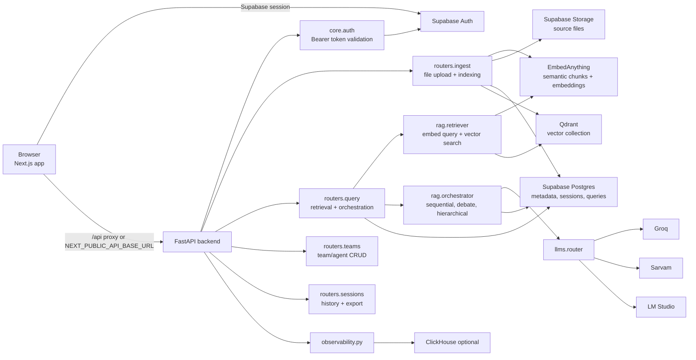
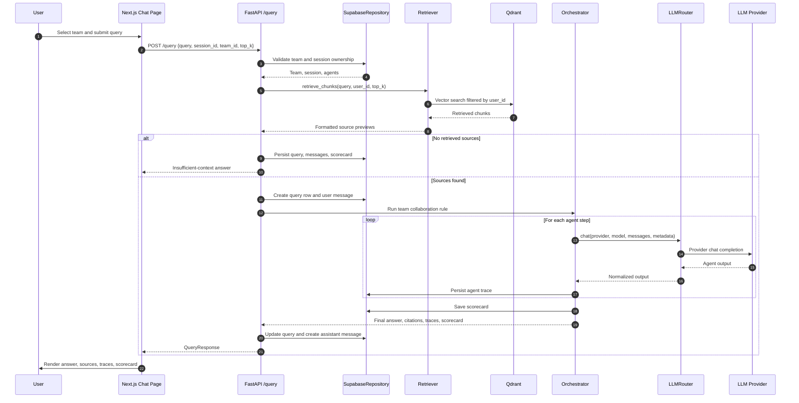
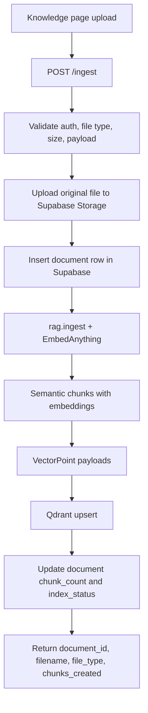
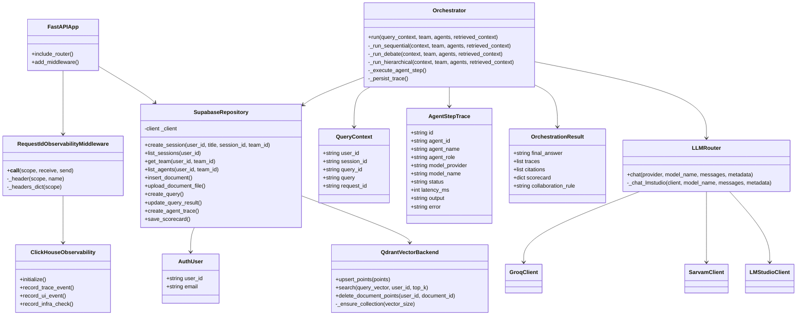

# Multi-Agent RAG Platform

Multi-Agent RAG Platform is a document-grounded chat application with team-scoped agent orchestration. Users authenticate with Supabase, upload documents, create teams and agents, run retrieval-backed queries, and inspect answers with sources, per-agent traces, and deterministic scorecards.

## What It Includes

- Next.js frontend for auth, dashboard, knowledge upload, team/agent setup, chat, history, and profile pages.
- FastAPI backend for ingest, retrieval, session/history persistence, team/agent CRUD, query orchestration, and observability.
- Supabase Auth, Postgres, and Storage for identity, application data, query history, traces, scorecards, and source files.
- Qdrant vector storage for user-scoped document chunks embedded through EmbedAnything.
- Multi-provider LLM routing through Groq, Sarvam, and LM Studio.
- Optional ClickHouse observability for backend traces, UI events, and infrastructure checks.

## System Architecture



## Query Data Flow



## Ingest Data Flow



## Core Class Diagram



## Main Runtime Paths

- `/ingest`: uploads source files, stores them in Supabase Storage, chunks and embeds them through EmbedAnything, and indexes vectors into Qdrant.
- `/query`: validates team/session ownership, retrieves user-scoped chunks, runs the selected team collaboration rule, and persists answer artifacts.
- `/sessions`: creates sessions, lists sessions, returns session detail, and exports session history as JSON.
- `/teams`: manages teams and agents, exposes provider model catalogs, default agent templates, and LM Studio probe endpoints.
- `/dashboard`: aggregates user metrics and query trends.
- `/observability`: accepts UI events and exposes infrastructure checks.

## Local Development

Create `.env` from the example and fill Supabase plus provider credentials:

```bash
cp .env.example .env
```

Run the core services with Docker:

```bash
docker compose up --build backend qdrant frontend
```

Then open:

- Frontend: `http://localhost:3000`
- Backend API: `http://localhost:8000`
- Qdrant: `http://localhost:6333`

Run backend tests:

```bash
cd backend
pytest
```

Run frontend checks:

```bash
cd frontend
npm run lint
npm run test
npm run build
```

## Environment Notes

Required Supabase values:

- `NEXT_PUBLIC_SUPABASE_URL`
- `NEXT_PUBLIC_SUPABASE_PUBLISHABLE_KEY`
- `SUPABASE_URL`
- `SUPABASE_SERVICE_ROLE_KEY`
- `SUPABASE_ANON_KEY`

LLM provider values depend on the agents you configure:

- Groq agents need `GROQ_API_KEY`.
- Sarvam agents need `SARVAM_API_KEY`.
- LM Studio agents need a reachable provider base URL configured on the agent.

Qdrant defaults to `http://qdrant:6333` in Docker. ClickHouse is optional and disabled by default with `CLICKHOUSE_ENABLED=false`.

## Repository Layout

```text
backend/                 FastAPI app, routers, RAG pipeline, LLM clients, tests
frontend/                Next.js app, API client, UI components, tests
supabase/migrations/     Supabase schema and RLS migrations
docs/                    Supporting project docs
docker-compose.yml       Local backend, frontend, Qdrant, Cloudflare tunnel, test profile
```

## Demo

See [demo.md](demo.md) for a step-by-step demo script.
